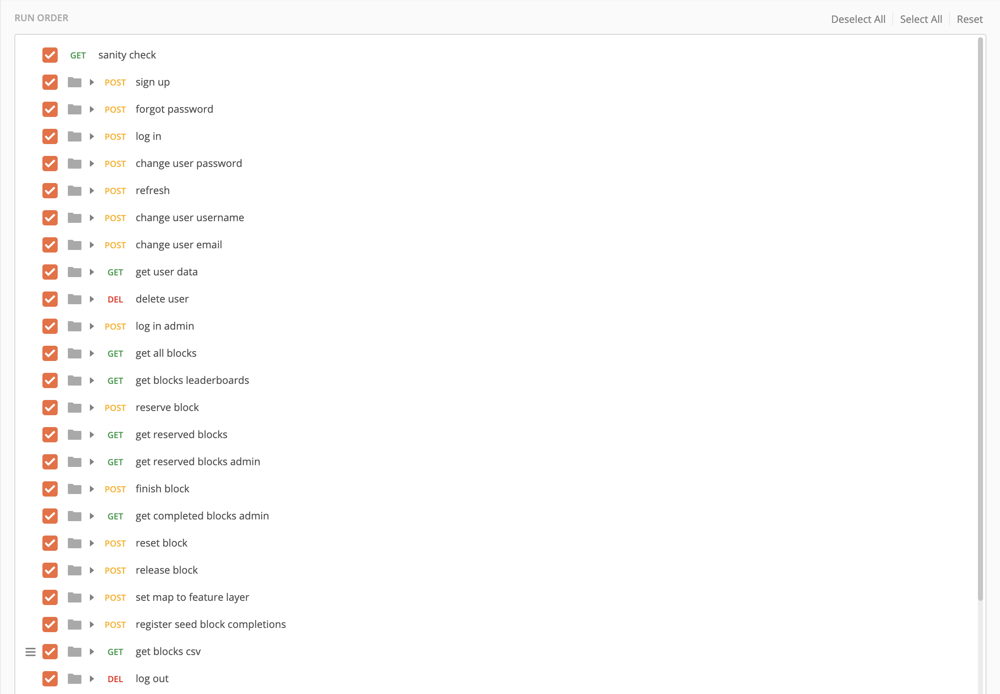

# Postman Testing

## Setup
Ensure that your psql db is set up correctly as described in the README in the root directory.

Add a user (either by manual insertion or sending a POST request to sign up a user) with the email of "admin.email@email.com" and password "password1234". Give this user admin privileges (by manual update).

Then run the collection in the order below by importing it with the Postman desktop or web app, or run it on the command line with `newman` which can be installed with `npm install -g newman`.

Teams routes should be tested individually, as each request requires different access keys. SEND the "log in admin" POST request, then send the "create team" POST request, then test leader routes as "admin.email@email.com" and member routes as "test.email@email.com". (The description of each request notes whether it should be tested as a team leader or as an applicant/member). Note that if you have previously created teams in your psql db, you will need to update the team_id path variable for some requests. 

